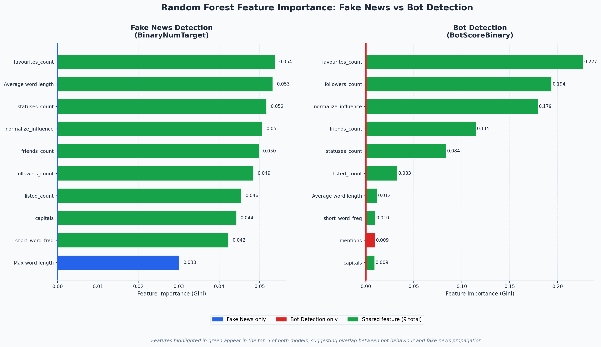

# Common Signals Behind Bots and Fake News Revealed

## Hook
The growing spread of fake news and automated accounts has created widespread confusion about what is real online. Protecting users worldwide requires social media platforms to detect and remove bot-driven content and misinformation before it causes harm.

## Problem Statement
Social media users are constantly exposed to posts, comments, and articles that may contain misleading or false claims. Verifying the accuracy of this information in real time is difficult, allowing misinformation to spread rapidly. This issue is further exacerbated by the growing presence of automated accounts, or bots, which can amplify and accelerate the dissemination of false content. This project aims to examine features indicating the presence of fake news and bots to create robust detection systems.

## Solution Description
The analysis seeks to find related features in both bot detection and fake news detection, in order to create robust systems that can protect users from multiple threats. Utilizing machine learning techniques we found that 9 out of 10 top features in both bot and fake news detection were shared. These features include: the amount of tweets favorited by the user, the average word length of singular tweets, the status count, the normalized influence of the user, the amount of friends the user had, the amount of followers the user has, the number of tweets the user has in lists, the use of capitalization, and the frequency of short words. These shared features are key to creating detection systems that can multi-task to protect users on multiple fronts, thus streamlining the response to fake news and bot-driven content before it causes harm to users.

## Chart

